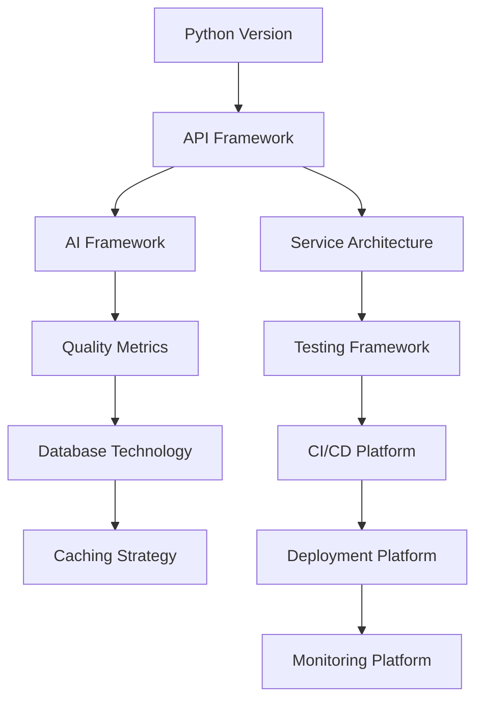

# Project Decisions Matrix

This document identifies the key decisions that need to be made to move the Laniakea-Edge project forward from research to implementation. Each decision requires an Architecture Decision Record (ADR) following the template at [`docs/ADR/ADR-TEMPLATE.md`](../ADR/ADR-TEMPLATE.md).

## Decision Evaluation Framework

### Standard Evaluation Criteria

All decisions should be evaluated against these core criteria:

1. **Technical Fit** - Does it meet functional requirements?
2. **Performance** - Can it handle expected load and scale?
3. **Maintainability** - Is it well-documented and actively maintained?
4. **Community** - Is there strong community support and ecosystem?
5. **Cost** - What are licensing, operational, and development costs?
6. **Risk** - What are potential failure modes and mitigation strategies?
7. **Team Expertise** - Do we have or can we acquire necessary skills?

### Decision Boundaries

To avoid overlap and conflicts, decisions are organized by architectural layer:
- **Infrastructure Layer**: Deployment, scaling, monitoring
- **Service Layer**: API framework, service boundaries, communication
- **Application Layer**: Business logic, quality metrics, analysis
- **Integration Layer**: External APIs, AI frameworks, data flow
- **Development Layer**: Testing, tooling, CI/CD

## Decision Categories and Realistic Timeline

### Phase 1: Foundation (Weeks 1-4)

#### 🔧 Core Technology Stack

**Decisions Required:**

1. **Primary API Framework Selection**
   - **Options**: FastAPI, Flask, Django REST Framework, Falcon
   - **Evaluation Criteria**:
     - Must support async operations (>1000 req/sec target)
     - Automatic OpenAPI/documentation generation required
     - Model Context Protocol compatibility
     - Development velocity and debugging tools
   - **Constraints**: Python 3.9+ compatibility, production-ready
   - **Success Metrics**: <100ms p95 latency, 99.9% uptime capability

2. **AI Agent Framework Selection**
   - **Options**: LangChain, LlamaIndex, Custom integration
   - **Evaluation Criteria**:
     - GitHub API integration capabilities
     - Tool/function calling support
     - Token optimization features
     - Extensibility for custom analyzers
   - **Constraints**: Must support major LLM providers
   - **Success Metrics**: <5s response time for analysis queries

3. **Python Version & Runtime**
   - **Options**: Python 3.9, 3.10, 3.11, 3.12
   - **Evaluation Criteria**:
     - Library compatibility requirements
     - Performance improvements
     - Long-term support timeline
   - **Constraints**: Must support all required dependencies
   - **Success Metrics**: Stable runtime with minimal CVEs

**Rationale:** These decisions establish the fundamental technical foundation and must be made before any code is written.

#### 🏗️ Service Architecture

**Decisions Required:**

1. **Service Boundaries & Communication**
   - **Options**: Microservices, Modular monolith, Serverless functions
   - **Evaluation Criteria**:
     - Service isolation and fault tolerance
     - Inter-service communication overhead
     - Deployment complexity vs flexibility
     - Development and debugging experience
   - **Constraints**: Must support independent scaling of analyzer components
   - **Success Metrics**: <10ms inter-service latency, independent deployment capability

2. **API Contract & Integration Pattern**
   - **Options**: REST, GraphQL, gRPC, WebSockets
   - **Evaluation Criteria**:
     - Model Context Protocol alignment
     - AI agent consumption patterns
     - Real-time vs batch processing needs
     - Schema evolution and versioning
   - **Constraints**: Must support streaming for large responses
   - **Success Metrics**: Clear API documentation, backward compatibility

**Rationale:** Architecture decisions provide the blueprint for the entire system and are difficult to change once implementation begins.

### Phase 2: Testing & Development Standards (Weeks 3-4)

#### 🧪 Testing Strategy

**Decisions Required:**

1. **Testing Framework & Coverage**
   - **Options**: pytest, unittest, nose2; Coverage targets
   - **Evaluation Criteria**:
     - Async test support capabilities
     - Fixture and mocking capabilities
     - Integration with CI/CD tools
     - Performance testing support
   - **Constraints**: Must support API and service testing
   - **Success Metrics**: >80% code coverage, <5min test suite execution

2. **Testing Levels**
   - **Options**: Unit only, Unit+Integration, Full E2E pyramid
   - **Evaluation Criteria**:
     - Development velocity impact
     - Bug detection effectiveness
     - Maintenance overhead
     - CI/CD pipeline complexity
   - **Constraints**: Must test AI agent integrations
   - **Success Metrics**: <1% defect escape rate to production

#### 🛠️ Development Environment & Tooling

**Decisions Required:**

1. **Development Environment Standards**
   - **Options**: Docker-based, Virtual environments, Dev containers
   - **Evaluation Criteria**:
     - Onboarding time for new developers
     - Environment consistency
     - Resource requirements
     - IDE integration support
   - **Constraints**: Must work on Mac, Linux, Windows (WSL2)
   - **Success Metrics**: <30min setup time, zero environment drift

2. **Code Quality Tools**
   - **Options**: black/ruff, mypy, pre-commit hooks
   - **Evaluation Criteria**:
     - Automation capabilities
     - Team adoption friction
     - Performance impact
     - Configuration flexibility
   - **Constraints**: Must integrate with CI/CD
   - **Success Metrics**: Zero style debates, automatic formatting

### Phase 3: Quality & Analysis Implementation (Weeks 5-8)

#### 📊 Quality Assessment Framework

**Decisions Required:**

1. **Quality Metrics & Scoring**
   - **Options**: Weighted scoring, ML-based scoring, Rule-based thresholds
   - **Evaluation Criteria**:
     - Transparency and explainability
     - Consistency across repositories
     - Adaptability to different IaC tools
     - Computational efficiency
   - **Constraints**: Must provide actionable recommendations
   - **Success Metrics**: <10% false positive rate, clear quality signals

2. **Repository Analysis Scope**
   - **Options**: Full history, Recent activity, Snapshot analysis
   - **Evaluation Criteria**:
     - GitHub API rate limit impact
     - Analysis completeness
     - Response time requirements
     - Storage requirements
   - **Constraints**: GitHub API limits (5000 req/hour)
   - **Success Metrics**: <30s analysis time per repository

#### 💾 Data Persistence & Caching

**Decisions Required:**

1. **Database Technology**
   - **Options**: PostgreSQL, MongoDB, Redis, SQLite
   - **Evaluation Criteria**:
     - Query performance requirements
     - Schema flexibility needs
     - Operational complexity
     - Scaling characteristics
   - **Constraints**: Must support JSON/document storage
   - **Success Metrics**: <10ms query latency, 99.99% durability

2. **Caching Strategy**
   - **Options**: Redis, In-memory, CDN, Database caching
   - **Evaluation Criteria**:
     - Cache invalidation complexity
     - Hit rate potential
     - Memory requirements
     - Distributed cache needs
   - **Constraints**: Must handle GitHub webhook updates
   - **Success Metrics**: >80% cache hit rate, <1s cache warming

### Phase 4: Infrastructure & Deployment (Weeks 9-12)

#### 🚀 CI/CD Pipeline Architecture

**Decisions Required:**

1. **CI/CD Platform**
   - **Options**: GitHub Actions, GitLab CI, Jenkins, CircleCI
   - **Evaluation Criteria**:
     - GitHub integration depth
     - Cost per build minute
     - Matrix testing support
     - Secret management capabilities
   - **Constraints**: Must support Docker builds and Python testing
   - **Success Metrics**: <10min build time, parallel job execution

2. **Deployment Pipeline Stages**
   - **Options**: Simple (test→deploy), Standard (test→stage→prod), Advanced (with canary/blue-green)
   - **Evaluation Criteria**:
     - Risk mitigation effectiveness
     - Rollback capabilities
     - Complexity vs benefit
     - Monitoring integration
   - **Constraints**: Must support automated rollback
   - **Success Metrics**: <5min deployment time, zero-downtime deploys

#### 🏗️ Infrastructure & Scaling

**Decisions Required:**

1. **Deployment Platform**
   - **Options**: AWS (ECS/Lambda), GCP (Cloud Run), Azure (Container Instances), Kubernetes
   - **Evaluation Criteria**:
     - Operational complexity
     - Cost at different scales
     - Auto-scaling capabilities
     - Monitoring/logging integration
   - **Constraints**: Must support containerized workloads
   - **Success Metrics**: <30s cold start, auto-scale to 100x load

2. **Container & Orchestration Strategy**
   - **Options**: Docker only, Docker Compose, Kubernetes, Serverless containers
   - **Evaluation Criteria**:
     - Local development experience
     - Production complexity
     - Resource efficiency
     - Debugging capabilities
   - **Constraints**: Must support local development
   - **Success Metrics**: <500MB image size, <5s container start

#### 🛡️ Resilience & Error Recovery

**Decisions Required:**

1. **Error Recovery Patterns**
   - **Options**: Circuit breakers, Retry with backoff, Bulkheads, Timeouts
   - **Evaluation Criteria**:
     - Failure isolation effectiveness
     - Recovery time objectives
     - Implementation complexity
     - Monitoring/alerting support
   - **Constraints**: Must handle GitHub API failures gracefully
   - **Success Metrics**: <1min recovery time, no cascading failures

2. **Data Consistency Strategy**
   - **Options**: Eventually consistent, Strong consistency, Event sourcing
   - **Evaluation Criteria**:
     - CAP theorem tradeoffs
     - Complexity vs requirements
     - Recovery procedures
     - Audit requirements
   - **Constraints**: Must handle partial analysis failures
   - **Success Metrics**: Zero data loss, consistent quality scores

### Phase 5: Monitoring & Operations (Weeks 13-14)

#### 📈 Observability Strategy

**Decisions Required:**

1. **Monitoring & Metrics Platform**
   - **Options**: Prometheus/Grafana, DataDog, New Relic, CloudWatch
   - **Evaluation Criteria**:
     - Cost per metric/host
     - Query capabilities
     - Alert flexibility
     - Integration ecosystem
   - **Constraints**: Must support custom business metrics
   - **Success Metrics**: <1min metric lag, 99.9% monitoring uptime

2. **Logging & Tracing**
   - **Options**: ELK Stack, Datadog, CloudWatch Logs, OpenTelemetry
   - **Evaluation Criteria**:
     - Log ingestion rate limits
     - Search capabilities
     - Retention costs
     - Correlation features
   - **Constraints**: Must support distributed tracing
   - **Success Metrics**: <5s log availability, 30-day retention

#### 🔒 Security & Compliance

**Decisions Required:**

1. **Authentication & API Security**
   - **Options**: API Keys, OAuth2, JWT, mTLS
   - **Evaluation Criteria**:
     - AI agent integration complexity
     - Key rotation capabilities
     - Rate limiting support
     - Audit trail completeness
   - **Constraints**: Must support Model Context Protocol auth
   - **Success Metrics**: <50ms auth overhead, zero auth bypasses

2. **Data Protection & Privacy**
   - **Options**: Encryption levels, PII handling, Data retention policies
   - **Evaluation Criteria**:
     - Compliance requirements (GDPR, SOC2)
     - Performance impact
     - Key management complexity
     - Backup/recovery procedures
   - **Constraints**: Must encrypt sensitive repository data
   - **Success Metrics**: AES-256 encryption, <24hr deletion compliance

## Decision Dependencies & Milestones

### Critical Path Dependencies

### Decision Milestones

| Week | Milestone | Decisions Required | Success Criteria |
|------|-----------|-------------------|------------------|
| 2 | Foundation Complete | API Framework, Python Version, AI Framework | ADRs approved, dev environment ready |
| 4 | Development Standards | Testing Strategy, Tooling, Service Architecture | CI/CD pipeline operational |
| 8 | Core Implementation | Quality Metrics, Database, Caching | MVP analyzer working |
| 12 | Infrastructure Ready | Deployment, CI/CD, Resilience | Staging environment live |
| 14 | Production Ready | Monitoring, Security, Compliance | All security scans passing |

### Parallel Decision Tracks

**Track 1: Core Technology (Weeks 1-4)**
- API Framework → Service Architecture → API Contracts

**Track 2: Quality System (Weeks 3-8)**
- Quality Metrics → Analysis Scope → Database/Caching

**Track 3: Operations (Weeks 7-14)**
- CI/CD → Deployment → Monitoring → Security

## ADR Creation Guidelines

### When to Create an ADR

- When making a significant architectural decision
- When changing an existing architectural decision
- When rejecting an architectural approach after evaluation
- When documenting design assumptions that may change

### ADR Quality Standards

- **Clear Context**: Explain the problem being solved
- **Defined Decision**: State what was chosen and why
- **Consequences**: Document positive, negative, and risk impacts
- **Alternatives**: List options considered and rejection rationale
- **Implementation**: Provide actionable implementation steps

### ADR Review Process

1. Draft ADR with all required sections
2. Technical review by team members
3. Stakeholder alignment on decision impacts
4. Final approval and implementation planning

## Current Decision Status & Ownership

### Decision Tracking

| Decision | Status | Owner | Target Date | ADR Link | Notes |
|----------|--------|-------|-------------|----------|-------|
| **Phase 1: Foundation** |
| API Framework | 🔄 In Progress | TBD | Week 2 | - | FastAPI leading candidate |
| AI Framework | 📋 Not Started | TBD | Week 2 | - | LangChain/LlamaIndex evaluation needed |
| Python Version | 📋 Not Started | TBD | Week 1 | - | 3.11 vs 3.12 comparison |
| Service Architecture | 📋 Not Started | TBD | Week 2 | - | Depends on API framework |
| **Phase 2: Development** |
| Testing Framework | 📋 Not Started | TBD | Week 3 | - | pytest likely choice |
| Dev Environment | 📋 Not Started | TBD | Week 3 | - | Docker vs venv evaluation |
| Code Quality Tools | 📋 Not Started | TBD | Week 4 | - | ruff vs black+mypy |
| **Phase 3: Quality** |
| Quality Metrics | 📋 Not Started | TBD | Week 5 | - | Scoring algorithm design |
| Database Technology | 📋 Not Started | TBD | Week 6 | - | PostgreSQL vs MongoDB |
| Caching Strategy | 📋 Not Started | TBD | Week 7 | - | Redis likely choice |
| **Phase 4: Infrastructure** |
| CI/CD Platform | 📋 Not Started | TBD | Week 9 | - | GitHub Actions evaluation |
| Deployment Platform | 📋 Not Started | TBD | Week 10 | - | Cloud provider selection |
| Resilience Patterns | 📋 Not Started | TBD | Week 11 | - | Circuit breaker implementation |
| **Phase 5: Operations** |
| Monitoring Platform | 📋 Not Started | TBD | Week 13 | - | Cost vs features analysis |
| Security Strategy | 📋 Not Started | TBD | Week 14 | - | Auth method selection |

### Status Legend

- ✅ **Completed**: Decision made and ADR approved
- 🔄 **In Progress**: Currently being evaluated
- 📋 **Not Started**: Pending evaluation
- ⏸️ **Blocked**: Waiting on dependencies
- ❌ **Rejected**: Decision reversed or abandoned

### Ownership Assignment Guidelines

**Owner Responsibilities:**
1. Research options and gather requirements
2. Create evaluation matrix with criteria scores
3. Write ADR following template
4. Present findings to team
5. Update this status table

**Assignment Priority:**
- Assign Phase 1 decisions immediately (blocking all other work)
- Assign Phase 2 decisions by Week 2
- Later phases can be assigned as earlier decisions complete

## References

- [ADR Template](../ADR/ADR-TEMPLATE.md)
- [Research Documentation](../research/)
- [Architecture Decision Records](../ADR/)

---

**This document serves as a roadmap for project advancement, ensuring all critical decisions are properly documented and evaluated through the ADR process.**
