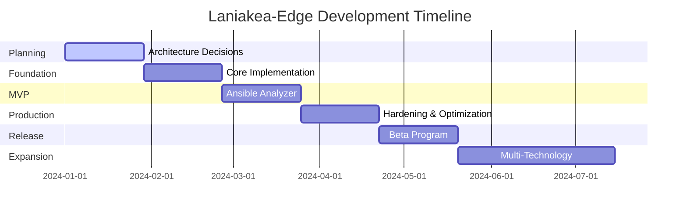

# Laniakea-Edge Project Roadmap

## Project Vision

Building a comprehensive quality assessment platform for Infrastructure-as-Code ecosystems, starting with Ansible and expanding to support Terraform, Kubernetes, and beyond.

## Development Phases

### 🎯 Phase 0: Planning & Architecture (Weeks 1-4) - **CURRENT**

**Status**: 🟡 In Progress

**Objectives:**
- Complete architectural decision documentation
- Establish development environment standards
- Define quality metrics framework
- Create proof-of-concept validation plan

**Key Deliverables:**
- [ ] Core technology ADRs (API, AI, Python, Architecture)
- [ ] Development environment setup
- [ ] CI/CD pipeline configuration
- [ ] Initial project structure

**Exit Criteria:**
- All Phase 1 decisions documented in ADRs
- Development environment reproducible
- Team aligned on architecture

---

### 🏗️ Phase 1: Foundation Implementation (Weeks 5-8)

**Status**: 📅 Planned

**Objectives:**
- Implement core orchestration service
- Build GitHub discovery service
- Create basic API gateway
- Establish inter-service communication

**Key Deliverables:**
- [ ] Core orchestration engine
- [ ] GitHub API integration service
- [ ] Basic API gateway with OpenAPI spec
- [ ] Service communication framework
- [ ] Unit test framework established

**Success Metrics:**
- Services communicate successfully
- GitHub API queries return results
- 80% unit test coverage achieved

---

### 🔍 Phase 2: Ansible Analyzer MVP (Weeks 9-12)

**Status**: 📅 Planned

**Objectives:**
- Implement Ansible-specific analyzer plugin
- Develop quality scoring algorithms
- Create comprehensive testing suite
- Build initial Model Context Protocol integration

**Key Deliverables:**
- [ ] Ansible analyzer plugin
- [ ] Quality scoring implementation
- [ ] Test detection capabilities
- [ ] Documentation quality assessment
- [ ] Basic MCP integration

**Success Metrics:**
- Analyze 10 Ansible repositories successfully
- Quality scores align with manual assessment
- <30s analysis time per repository

---

### 🚀 Phase 3: Production Readiness (Weeks 13-16)

**Status**: 📅 Planned

**Objectives:**
- Implement caching layer
- Add monitoring and observability
- Enhance error handling and resilience
- Complete security hardening

**Key Deliverables:**
- [ ] Redis caching implementation
- [ ] Monitoring dashboard (Prometheus/Grafana)
- [ ] Circuit breakers and retry logic
- [ ] Authentication and rate limiting
- [ ] Performance optimization

**Success Metrics:**
- 99.9% uptime capability
- <100ms API response time (p95)
- Handle 100+ concurrent requests
- Pass security audit

---

### 📦 Phase 4: Beta Release (Weeks 17-20)

**Status**: 📅 Planned

**Objectives:**
- Deploy to production environment
- Onboard beta users
- Gather feedback and iterate
- Prepare public documentation

**Key Deliverables:**
- [ ] Production deployment
- [ ] Public API documentation
- [ ] Integration guides
- [ ] Beta user onboarding
- [ ] Feedback collection system

**Success Metrics:**
- 10+ beta users onboarded
- <5% error rate in production
- Positive user feedback score

---

### 🌍 Phase 5: Multi-Technology Expansion (Weeks 21-28)

**Status**: 📅 Future

**Objectives:**
- Add Terraform analyzer plugin
- Implement Kubernetes manifest analysis
- Create Helm chart evaluation
- Standardize cross-technology metrics

**Key Deliverables:**
- [ ] Terraform analyzer plugin
- [ ] Kubernetes analyzer plugin
- [ ] Helm analyzer plugin
- [ ] Unified quality framework
- [ ] Technology comparison features

**Success Metrics:**
- 3+ technologies supported
- Consistent scoring across technologies
- Maintain <30s analysis time

---

### 🎨 Phase 6: Enhanced Features (Weeks 29-36)

**Status**: 📅 Future

**Objectives:**
- Build web UI for direct access
- Add historical tracking
- Implement webhooks for CI/CD
- Create recommendation engine

**Key Deliverables:**
- [ ] Web UI (optional)
- [ ] Historical data tracking
- [ ] GitHub webhook integration
- [ ] AI-powered recommendations
- [ ] Batch analysis capabilities

---

## Risk Mitigation Schedule

| Risk | Mitigation | Target Date |
|------|------------|-------------|
| GitHub API rate limits | Implement caching early | Week 6 |
| Performance bottlenecks | Load testing in Phase 2 | Week 11 |
| Security vulnerabilities | Security audit in Phase 3 | Week 15 |
| User adoption | Beta program in Phase 4 | Week 17 |

## Milestone Timeline

## Success Criteria by Quarter

### Q1 2024 (Weeks 1-12)
- ✅ Architecture decisions complete
- ✅ Foundation services operational
- ✅ Ansible analyzer MVP functional

### Q2 2024 (Weeks 13-24)
- ⏳ Production deployment live
- ⏳ Beta users onboarded
- ⏳ Second technology added

### Q3 2024 (Weeks 25-36)
- ⏳ Three technologies supported
- ⏳ Enhanced features released
- ⏳ 100+ active users

## Resource Requirements

### Phase 0-2 (MVP)
- 1-2 developers
- GitHub API access
- Development infrastructure

### Phase 3-4 (Production)
- 2-3 developers
- Cloud infrastructure budget
- Monitoring tools licenses

### Phase 5-6 (Expansion)
- 3-4 developers
- UI/UX designer (Phase 6)
- Increased infrastructure capacity

## Decision Gates

Each phase transition requires:
1. Completion of key deliverables
2. Success metrics achievement
3. Stakeholder approval
4. Next phase resources confirmed

---

*This roadmap is a living document and will be updated as the project progresses.*