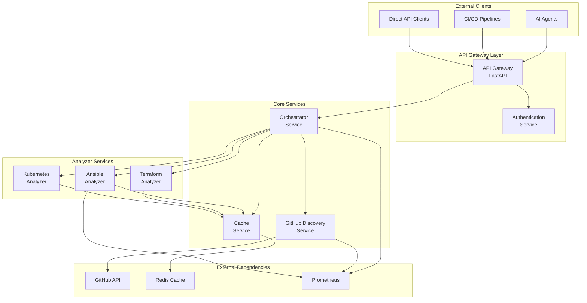
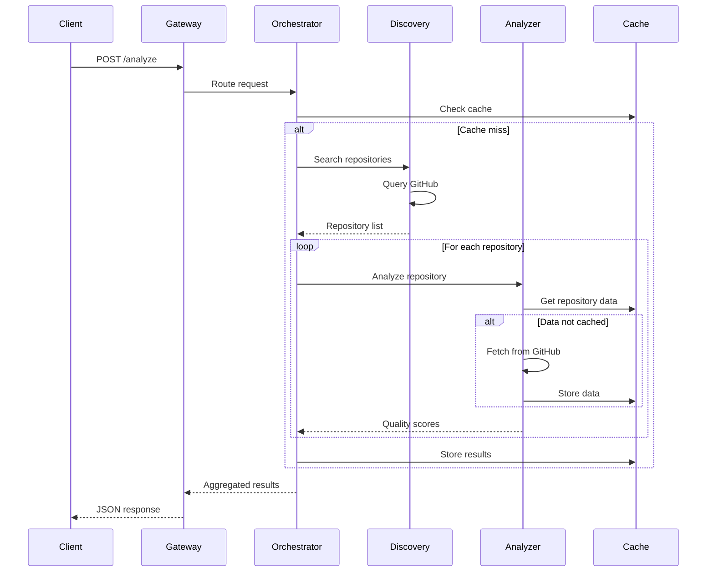

# System Architecture Design

## Overview

Laniakea-Edge follows a microservices architecture pattern with an AI-first design philosophy. The system operates as a headless API service that integrates with AI agents through the Model Context Protocol.

## High-Level Architecture



## System Components

### API Gateway
- **Technology**: FastAPI (pending ADR)
- **Responsibilities**:
  - Request routing
  - Rate limiting
  - Authentication/authorization
  - OpenAPI documentation
  - Model Context Protocol implementation

### Orchestrator Service
- **Purpose**: Central coordination and workflow management
- **Responsibilities**:
  - Request decomposition
  - Service coordination
  - Result aggregation
  - Error handling
  - Retry logic

### GitHub Discovery Service
- **Purpose**: Repository search and retrieval
- **Responsibilities**:
  - GitHub API integration
  - Search query optimization
  - Rate limit management
  - Result filtering and ranking

### Analyzer Services (Pluggable)
- **Purpose**: Technology-specific quality analysis
- **Responsibilities**:
  - Repository structure analysis
  - Quality metric calculation
  - Testing framework detection
  - Documentation assessment

### Cache Service
- **Purpose**: Performance optimization and rate limit mitigation
- **Responsibilities**:
  - GitHub data caching
  - Analysis result caching
  - Cache invalidation
  - TTL management

## Design Principles

### 1. Service Isolation
Each service is independently deployable and scalable with clear boundaries and minimal coupling.

### 2. API-First Design
All functionality exposed through well-defined APIs with OpenAPI specifications and versioning support.

### 3. Async Operations
Non-blocking operations throughout the system for optimal performance and resource utilization.

### 4. Pluggable Architecture
New IaC technologies can be added as analyzer plugins without modifying core services.

### 5. Failure Resilience
Circuit breakers, retries, and graceful degradation ensure system stability.

## Data Flow

### Repository Analysis Flow



## Deployment Architecture

### Container Strategy
```yaml
services:
  api-gateway:
    image: laniakea/gateway:latest
    ports: ["8000:8000"]
    replicas: 2
    
  orchestrator:
    image: laniakea/orchestrator:latest
    replicas: 2
    
  github-discovery:
    image: laniakea/discovery:latest
    replicas: 1  # Rate limit bound
    
  ansible-analyzer:
    image: laniakea/analyzer-ansible:latest
    replicas: 3
    
  cache-service:
    image: laniakea/cache:latest
    replicas: 2
```

### Scaling Strategy

| Service | Scaling Type | Trigger | Max Instances |
|---------|-------------|---------|---------------|
| API Gateway | Horizontal | CPU > 70% | 10 |
| Orchestrator | Horizontal | Queue depth | 10 |
| Discovery | Vertical | Rate limits | 2 |
| Analyzers | Horizontal | Queue depth | 20 |
| Cache | Horizontal | Memory > 80% | 5 |

## Security Architecture

### Authentication Layers
1. **API Key Authentication**: For CI/CD and direct clients
2. **OAuth2**: For AI agent platforms
3. **Service Mesh mTLS**: For inter-service communication

### Security Controls
- Input validation at gateway
- Rate limiting per client
- Encrypted communication (TLS 1.3)
- Secrets management (HashiCorp Vault)
- Audit logging for all requests

## Monitoring & Observability

### Metrics Collection
- **Prometheus**: Time-series metrics
- **Grafana**: Visualization dashboards
- **Alert Manager**: Incident notification

### Key Metrics
- Request latency (p50, p95, p99)
- Error rates by service
- GitHub API usage
- Cache hit rates
- Service availability

### Distributed Tracing
- OpenTelemetry instrumentation
- Request flow visualization
- Performance bottleneck identification

## Failure Handling

### Circuit Breaker Pattern
```python
# Pseudo-code example
circuit_breaker = CircuitBreaker(
    failure_threshold=5,
    recovery_timeout=60,
    expected_exception=GitHubAPIError
)

@circuit_breaker
def call_github_api():
    # API call implementation
    pass
```

### Retry Strategy
- Exponential backoff for transient failures
- Maximum 3 retries with jitter
- Dead letter queue for permanent failures

### Graceful Degradation
1. **Partial Results**: Return available data when some services fail
2. **Cached Fallback**: Serve stale cache on service unavailability
3. **Reduced Functionality**: Disable non-critical features under load

## Performance Targets

### Latency Requirements
- API Gateway: <10ms overhead
- Orchestration: <50ms coordination
- Analysis: <30s per repository
- Cache lookup: <5ms

### Throughput Targets
- 1000 requests/second (burst)
- 100 concurrent analyses
- 10,000 daily repository analyses

### Resource Limits
- Memory: 512MB per service (except analyzers: 1GB)
- CPU: 0.5 cores per service (except analyzers: 1 core)
- Storage: 100GB total cache size

## Technology Stack Summary

| Component | Technology | Status |
|-----------|------------|--------|
| API Framework | FastAPI | Pending ADR |
| Language | Python 3.11+ | Pending ADR |
| Container | Docker | Confirmed |
| Orchestration | Kubernetes/ECS | Pending ADR |
| Cache | Redis | Likely |
| Monitoring | Prometheus/Grafana | Likely |
| Tracing | OpenTelemetry | Planned |

## Evolution Path

### Phase 1: MVP
- Single orchestrator
- One analyzer (Ansible)
- Basic caching
- Simple API gateway

### Phase 2: Production
- Multiple analyzers
- Advanced caching
- Full monitoring
- Security hardening

### Phase 3: Scale
- Auto-scaling
- Multi-region
- Advanced analytics
- ML-based scoring

---

*This system design provides the architectural blueprint for Laniakea-Edge implementation.*