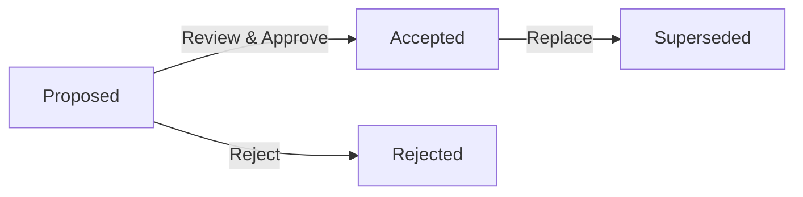

# Architecture Decision Records (ADRs)

This folder contains all Architecture Decision Records for the Laniakea-Edge project. ADRs document important architectural decisions along with their context and consequences.

## 📁 Folder Structure

```
4-decisions/
├── template/          # ADR template
├── proposed/          # Decisions under evaluation
├── accepted/          # Approved decisions
└── superseded/        # Replaced decisions
```

## 📊 ADR Status Overview

### Summary Statistics
| Status | Count | Percentage |
|--------|-------|------------|
| Proposed | 0 | 0% |
| Accepted | 0 | 0% |
| Superseded | 0 | 0% |
| **Total** | **0** | - |

### Pending Decisions (Phase 1 Priority)

| Decision | Priority | Target Date | Status |
|----------|----------|-------------|--------|
| API Framework Selection | 🔴 Critical | Week 2 | Not Started |
| AI Framework Selection | 🔴 Critical | Week 2 | Not Started |
| Python Version | 🔴 Critical | Week 1 | Not Started |
| Service Architecture | 🔴 Critical | Week 2 | Not Started |

## 📝 ADR Process

### Creating a New ADR

1. **Copy the template**:
   ```bash
   cp template/ADR-TEMPLATE.md proposed/ADR-YYYY-MM-DD-title.md
   ```

2. **Fill out all sections**:
   - Status (Proposed)
   - Context (problem background)
   - Decision (what we're doing)
   - Consequences (positive, negative, risks)
   - Alternatives (options considered)
   - Implementation (action items)

3. **Submit for review**:
   - Create pull request
   - Tag relevant stakeholders
   - Schedule review meeting if needed

### ADR Lifecycle



### Review Criteria

ADRs are evaluated based on:
- **Completeness**: All sections filled comprehensively
- **Clarity**: Decision and rationale are clear
- **Evidence**: Data/research supports the decision
- **Impact**: Consequences are well understood
- **Alternatives**: Other options were considered

## 📋 ADR Index

### Proposed
*No ADRs currently proposed*

### Accepted
*No ADRs currently accepted*

### Superseded
*No ADRs currently superseded*

## 🎯 Upcoming Decisions Queue

### Week 1 (Immediate)
- [ ] ADR-001: Python Version Selection (3.11 vs 3.12)

### Week 2 (Critical)
- [ ] ADR-002: API Framework Selection (FastAPI vs Flask vs Django)
- [ ] ADR-003: AI Framework Selection (LangChain vs LlamaIndex)
- [ ] ADR-004: Service Architecture Pattern (Microservices vs Monolith)

### Week 3-4 (Important)
- [ ] ADR-005: Testing Framework and Strategy
- [ ] ADR-006: Container and Orchestration Platform
- [ ] ADR-007: Database Technology Selection
- [ ] ADR-008: Caching Strategy

### Week 5-8 (Planning)
- [ ] ADR-009: CI/CD Platform Selection
- [ ] ADR-010: Monitoring and Observability Stack
- [ ] ADR-011: Security and Authentication Approach
- [ ] ADR-012: Deployment Platform and Strategy

## 📐 ADR Template Structure

Each ADR follows this structure:
```markdown
# ADR-YYYY-MM-DD: [Title]

## Status
Proposed | Accepted | Superseded | Deprecated

## Context
What is the issue we're seeing that is motivating this decision?

## Decision
What we're doing and how we're doing it.

## Consequences
### Positive
- What becomes easier or better?

### Negative
- What becomes harder or more complex?

### Risks
- What could go wrong?

## Alternatives Considered
### Alternative 1: [Name]
- Description
- Why we didn't choose it

## Implementation
Key steps to implement this decision

## References
- Links to relevant documentation
```

## 🔍 Finding ADRs

### By Category
- **Infrastructure**: Deployment, scaling, monitoring
- **Architecture**: Services, communication, patterns
- **Technology**: Languages, frameworks, libraries
- **Security**: Authentication, authorization, encryption
- **Development**: Testing, CI/CD, tooling

### By Impact
- **High Impact**: Affects entire system architecture
- **Medium Impact**: Affects specific services/components
- **Low Impact**: Local optimizations or tools

### By Date
ADRs are named with date prefix (YYYY-MM-DD) for chronological ordering.

## 📊 Decision Metrics

### Decision Velocity
- Target: 2-3 decisions per week during Phase 0
- Current: 0 decisions per week
- Status: 🔴 Behind schedule

### Decision Quality
Measured by:
- Time to implementation
- Reversal rate
- Team satisfaction
- Technical debt created

## 🔗 Related Documentation

### Context and Research
- [`../1-research/`](../1-research/) - Background research
- [`../2-planning/decisions-matrix.md`](../2-planning/decisions-matrix.md) - Decision tracking

### Implementation Guidance
- [`../3-architecture/`](../3-architecture/) - Architecture documentation
- [`../5-reference/tech-stack.md`](../5-reference/tech-stack.md) - Technology options

## 📅 Review Schedule

| Day | Activity |
|-----|----------|
| Monday | New ADRs proposed |
| Wednesday | Team review session |
| Friday | Approval/feedback |

## 🚦 ADR Health Indicators

### Good Signs ✅
- Clear problem statement
- Multiple alternatives evaluated
- Quantifiable success criteria
- Implementation plan included
- Team consensus achieved

### Warning Signs ⚠️
- Vague problem definition
- Single solution considered
- No success metrics
- Missing implementation steps
- Lack of team buy-in

## 📝 Maintenance

### Regular Tasks
- Weekly: Update ADR index
- Monthly: Review superseded ADRs
- Quarterly: ADR process retrospective

### Quality Checks
- [ ] All decisions have ADRs
- [ ] ADRs follow template
- [ ] Status is current
- [ ] Implementation tracked

---

*This directory will grow as architectural decisions are made and documented throughout the project lifecycle.*