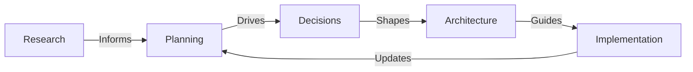

# Laniakea-Edge Documentation

This directory contains comprehensive documentation for the **Laniakea-Edge** project, an AI-powered quality engine for Infrastructure-as-Code repositories.

## 📚 Documentation Structure

The documentation is organized into five main sections following a logical progression from research through implementation:

```
docs/
├── research/      # Completed research and analysis
├── planning/      # Active planning and tracking
├── architecture/  # Technical design documentation
├── decisions/     # Architecture Decision Records
└── reference/     # Quick reference guides
```

## 📁 Directory Overview

### [research/](./research/) - Research Phase Documentation
**Status**: ✅ Complete

Contains the foundational research that informed the project's direction:
- **Problem Analysis**: Core "signal vs. noise" problem in IaC ecosystems
- **Market Analysis**: Existing solutions and competitive landscape
- **Technical Research**: Architecture patterns and technology evaluation

*These are read-only reference documents from the completed research phase.*

### [planning/](./planning/) - Planning & Tracking
**Status**: 🔄 Active

Living documents that guide project execution:
- **[decisions-matrix.md](./planning/decisions-matrix.md)**: Primary decision tracking document
- **[roadmap.md](./planning/roadmap.md)**: Project phases and timeline
- **[requirements.md](./planning/requirements.md)**: Functional and non-functional requirements
- **[risk-register.md](./planning/risk-register.md)**: Risk identification and mitigation
- **[poc-plan.md](./planning/poc-plan.md)**: Proof of concept strategy

*These documents are actively maintained throughout the project.*

### [architecture/](./architecture/) - Architecture Documentation
**Status**: ✅ Designed

Technical architecture and design specifications:
- **[system-design.md](./architecture/system-design.md)**: High-level system architecture
- **[microservices.md](./architecture/microservices.md)**: Service definitions and boundaries
- **[api-design.md](./architecture/api-design.md)**: API specifications and contracts
- **[quality-framework.md](./architecture/quality-framework.md)**: Quality assessment methodology

*These define the technical blueprint for implementation.*

### [decisions/](./decisions/) - Architecture Decision Records
**Status**: 📋 Pending

Formal documentation of architectural decisions:
- **template/**: ADR template for new decisions
- **proposed/**: Decisions under evaluation
- **accepted/**: Approved architectural decisions
- **superseded/**: Replaced or outdated decisions

*ADRs will be created as decisions are made during Phase 0.*

### [reference/](./reference/) - Quick Reference
**Status**: ✅ Complete

Quick reference guides and summaries:
- **[glossary.md](./reference/glossary.md)**: Terms and acronyms
- **[tech-stack.md](./reference/tech-stack.md)**: Technology choices and status
- **[checklist.md](./reference/checklist.md)**: Pre-implementation checklist

*Handy references for team members and contributors.*

## 🎯 Current Project Status

### Phase 0: Planning & Architecture (Current)

| Area | Status | Next Action |
|------|--------|-------------|
| Research | ✅ Complete | Reference for decisions |
| Planning | 🔄 Active | Complete Phase 1 decisions |
| Architecture | ✅ Designed | Validate with POC |
| Decisions | 📋 Pending | Create first ADRs |
| Reference | ✅ Complete | Use during implementation |

### Critical Path (Next 2 Weeks)

1. **Week 1**: Python version decision, POC setup
2. **Week 2**: API framework, AI framework, service architecture decisions
3. **Week 3-4**: POC implementation and validation

## 📖 How to Use This Documentation

### For Different Roles

#### 🧑‍💻 Developers
1. Start with [`architecture/`](./architecture/) for technical design
2. Check [`reference/tech-stack.md`](./reference/tech-stack.md) for technology choices
3. Review [`reference/checklist.md`](./reference/checklist.md) before coding

#### 📊 Project Managers
1. Monitor [`planning/roadmap.md`](./planning/roadmap.md) for timeline
2. Track [`planning/risk-register.md`](./planning/risk-register.md) for risks
3. Review [`planning/decisions-matrix.md`](./planning/decisions-matrix.md) for decision status

#### 🏗️ Architects
1. Reference [`research/`](./research/) for background
2. Create ADRs in [`decisions/`](./decisions/)
3. Update [`architecture/`](./architecture/) as needed

#### 🆕 New Team Members
1. Read [`research/README.md`](./research/README.md) for project context
2. Review [`planning/requirements.md`](./planning/requirements.md) for scope
3. Check [`reference/glossary.md`](./reference/glossary.md) for terminology

### Navigation Tips

- **📍 Start Here**: [`planning/decisions-matrix.md`](./planning/decisions-matrix.md) - Current focus
- **🗺️ Big Picture**: [`planning/roadmap.md`](./planning/roadmap.md) - Where we're going
- **⚠️ Risks**: [`planning/risk-register.md`](./planning/risk-register.md) - What to watch
- **✅ Checklist**: [`reference/checklist.md`](./reference/checklist.md) - Ready to code?

## 📝 Documentation Standards

### Document Types

| Type | Location | Purpose | Update Frequency |
|------|----------|---------|------------------|
| Research | `research/` | Historical reference | Never (complete) |
| Planning | `planning/` | Active tracking | Daily/Weekly |
| Architecture | `architecture/` | Technical specs | As needed |
| Decisions | `decisions/` | Formal choices | Per decision |
| Reference | `reference/` | Quick lookup | As needed |

### Quality Guidelines

- **Clarity**: Write for your audience (technical vs. management)
- **Completeness**: Include all necessary context
- **Consistency**: Follow existing patterns and formats
- **Currency**: Keep living documents up-to-date

## 🔄 Documentation Workflow



## 📊 Documentation Health Metrics

| Metric | Target | Current | Status |
|--------|--------|---------|--------|
| Research Docs | 100% | 100% | ✅ |
| Planning Docs | 100% | 100% | ✅ |
| Architecture Docs | 100% | 100% | ✅ |
| ADRs Written | 4 | 0 | 🔴 |
| Reference Docs | 100% | 100% | ✅ |

## 🚀 Next Steps

### Immediate (This Week)
1. Review [`planning/decisions-matrix.md`](./planning/decisions-matrix.md)
2. Create first ADR for Python version
3. Start POC implementation per [`planning/poc-plan.md`](./planning/poc-plan.md)

### Short Term (Next 2 Weeks)
1. Complete all Phase 1 ADRs
2. Validate architecture with POC
3. Update planning docs based on POC results

### Long Term (Month 1)
1. Transition from planning to implementation
2. Maintain documentation as living artifacts
3. Onboard team members using docs

## 🔗 External Resources

- **Project Repository**: [GitHub - Laniakea-Edge](https://github.com/your-org/laniakea-edge)
- **Model Context Protocol**: [MCP Documentation](https://modelcontextprotocol.io)
- **FastAPI**: [FastAPI Documentation](https://fastapi.tiangolo.com)
- **LangChain**: [LangChain Documentation](https://langchain.com)

## 📞 Documentation Support

For documentation questions or improvements:
- Create an issue with `docs` label
- Submit a PR with proposed changes
- Contact the documentation owner

---

**Documentation Version**: 2.0  
**Last Reorganization**: January 2025  
**Maintainer**: Project Team

*This documentation structure supports the project from planning through production, providing clear organization and easy navigation for all stakeholders.*
