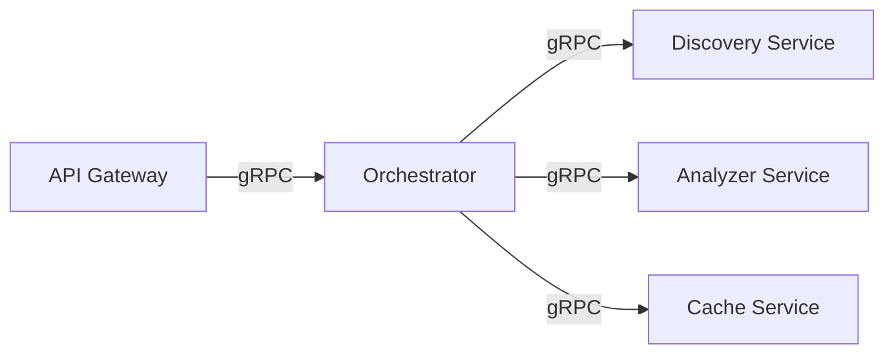
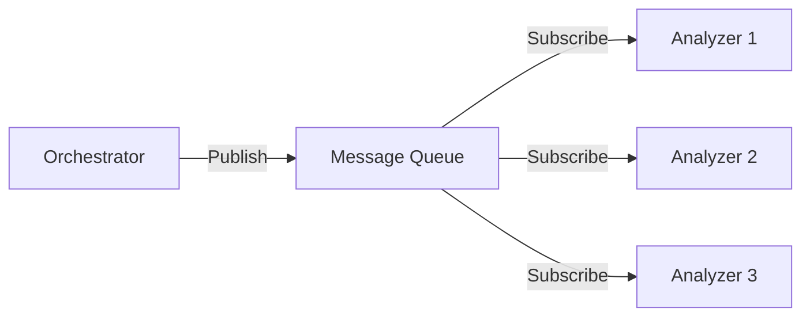
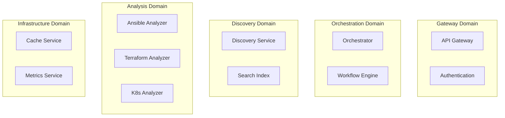
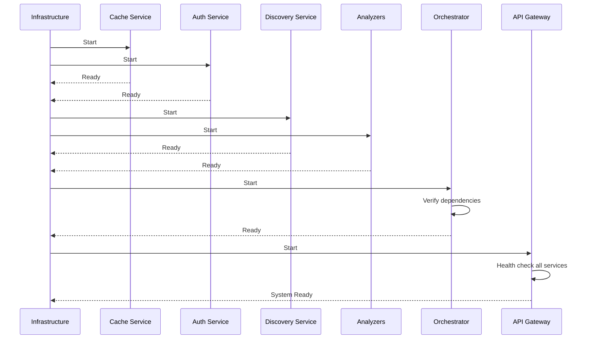
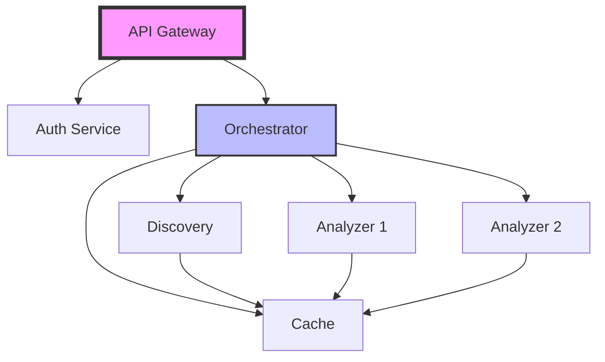

# Microservices Architecture

## Service Catalog

### Core Services

#### API Gateway Service
**Purpose**: Single entry point for all client requests

**Responsibilities**:
- Request routing and load balancing
- Authentication and authorization
- Rate limiting and throttling
- Request/response transformation
- API documentation serving

**Interfaces**:
- **Inbound**: REST API (port 8000)
- **Outbound**: gRPC to internal services

**Dependencies**:
- Authentication Service
- Orchestrator Service

**Data Ownership**: None (stateless)

---

#### Orchestrator Service
**Purpose**: Workflow coordination and business logic

**Responsibilities**:
- Request decomposition into tasks
- Service orchestration and coordination
- Result aggregation and synthesis
- Retry and error handling logic
- Workflow state management

**Interfaces**:
- **Inbound**: gRPC from API Gateway
- **Outbound**: gRPC to all services

**Dependencies**:
- Discovery Service
- Analyzer Services
- Cache Service

**Data Ownership**: Workflow state (temporary)

---

#### GitHub Discovery Service
**Purpose**: Repository search and metadata retrieval

**Responsibilities**:
- GitHub API query construction
- Search result filtering and ranking
- Repository metadata extraction
- Rate limit management
- Pagination handling

**Interfaces**:
- **Inbound**: gRPC from Orchestrator
- **Outbound**: HTTPS to GitHub API

**Dependencies**:
- GitHub API (external)
- Cache Service

**Data Ownership**: Search indexes (cached)

---

### Analyzer Services

#### Ansible Analyzer Service
**Purpose**: Ansible-specific quality assessment

**Responsibilities**:
- Role/Collection structure validation
- Molecule test detection
- ansible-lint integration check
- Galaxy metadata parsing
- Best practices evaluation

**Interfaces**:
- **Inbound**: gRPC from Orchestrator
- **Outbound**: HTTPS to GitHub

**Dependencies**:
- Cache Service
- GitHub API (via cache)

**Data Ownership**: Ansible quality metrics

---

#### Terraform Analyzer Service (Future)
**Purpose**: Terraform module quality assessment

**Responsibilities**:
- Module structure validation
- Terraform test detection
- Documentation completeness
- Provider compatibility check
- Security scanning

**Interfaces**:
- **Inbound**: gRPC from Orchestrator
- **Outbound**: HTTPS to GitHub

**Dependencies**:
- Cache Service
- GitHub API (via cache)

**Data Ownership**: Terraform quality metrics

---

### Support Services

#### Cache Service
**Purpose**: Performance optimization and rate limit mitigation

**Responsibilities**:
- GitHub data caching
- Analysis result caching
- Cache invalidation logic
- TTL management
- Cache warming strategies

**Interfaces**:
- **Inbound**: gRPC from all services
- **Outbound**: Redis protocol

**Dependencies**:
- Redis (external)

**Data Ownership**: Cached data (temporary)

---

#### Authentication Service
**Purpose**: Client authentication and authorization

**Responsibilities**:
- API key validation
- OAuth2 flow handling
- Token generation and validation
- Permission checking
- Audit logging

**Interfaces**:
- **Inbound**: gRPC from API Gateway
- **Outbound**: Database connection

**Dependencies**:
- User database

**Data Ownership**: User credentials and permissions

## Service Communication

### Communication Patterns

#### Synchronous Communication


**When to Use**:
- Request-response patterns
- Real-time data requirements
- Simple workflows

**Implementation**:
- gRPC for internal services
- REST for external APIs
- Circuit breakers for resilience

#### Asynchronous Communication (Future)


**When to Use**:
- Long-running operations
- Batch processing
- Event-driven workflows

**Implementation**:
- Message queues (RabbitMQ/Kafka)
- Event sourcing for audit
- Saga pattern for transactions

### Service Contracts

#### gRPC Proto Definition Example
```protobuf
syntax = "proto3";

package laniakea.discovery.v1;

service DiscoveryService {
  rpc SearchRepositories(SearchRequest) returns (SearchResponse);
  rpc GetRepository(GetRepositoryRequest) returns (Repository);
}

message SearchRequest {
  string query = 1;
  string technology = 2;
  int32 limit = 3;
  map<string, string> filters = 4;
}

message SearchResponse {
  repeated Repository repositories = 1;
  int32 total_count = 2;
  string next_page_token = 3;
}

message Repository {
  string id = 1;
  string url = 2;
  string name = 3;
  map<string, string> metadata = 4;
}
```

## Service Boundaries

### Domain Boundaries



### Data Boundaries

| Service | Owns Data | Accesses Data | Never Accesses |
|---------|-----------|---------------|----------------|
| API Gateway | - | User credentials | Repository data |
| Orchestrator | Workflow state | All service data | User credentials |
| Discovery | Search indexes | GitHub data | Analysis results |
| Analyzers | Quality metrics | GitHub data | User data |
| Cache | Cached data | All cacheable data | User credentials |

## Service Lifecycle

### Service Startup Sequence



### Health Checks

Each service implements:
```yaml
/health/live:   # Kubernetes liveness
  - Process running
  - No deadlocks
  
/health/ready:  # Kubernetes readiness  
  - Dependencies reachable
  - Caches warm
  - Initialization complete
  
/health/startup: # Kubernetes startup
  - Configuration loaded
  - Connections established
  - Initial data loaded
```

## Service Configuration

### Configuration Management

```yaml
# service-config.yaml
service:
  name: discovery-service
  version: 1.0.0
  
server:
  port: 50051
  max_connections: 100
  
dependencies:
  github:
    base_url: https://api.github.com
    timeout: 30s
    retry_count: 3
    
  cache:
    host: cache-service
    port: 50052
    
observability:
  metrics:
    enabled: true
    port: 9090
  tracing:
    enabled: true
    sample_rate: 0.1
```

### Environment Variables

```bash
# Common to all services
SERVICE_NAME=discovery-service
SERVICE_VERSION=1.0.0
LOG_LEVEL=INFO
ENVIRONMENT=production

# Service specific
GITHUB_TOKEN=${SECRET_GITHUB_TOKEN}
CACHE_SERVICE_URL=cache-service:50052
MAX_WORKERS=10
```

## Service Testing

### Testing Pyramid

```
         /\
        /E2E\        <- End-to-end tests (5%)
       /______\
      /        \
     /Integration\    <- Integration tests (25%)
    /______________\
   /                \
  /   Unit Tests     \  <- Unit tests (70%)
 /____________________\
```

### Contract Testing

```python
# Consumer-driven contract test example
def test_discovery_service_contract():
    # Consumer (Orchestrator) defines expected contract
    expected_response = {
        "repositories": [
            {"id": str, "url": str, "name": str}
        ],
        "total_count": int,
        "next_page_token": str
    }
    
    # Test against provider (Discovery Service)
    response = discovery_client.search_repositories(
        query="ansible role mysql"
    )
    
    assert_matches_schema(response, expected_response)
```

## Service Deployment

### Deployment Strategy

| Service | Strategy | Rollback Time | Health Check |
|---------|----------|---------------|--------------|
| API Gateway | Blue-Green | <1 min | HTTP 200 |
| Orchestrator | Rolling | <5 min | gRPC health |
| Discovery | Canary | <3 min | Search test |
| Analyzers | Rolling | <5 min | Analysis test |
| Cache | Rolling | <2 min | Redis ping |

### Service Dependencies



## Service Monitoring

### Key Metrics per Service

| Service | Golden Signals | SLI | SLO |
|---------|---------------|-----|-----|
| API Gateway | Latency, Traffic, Errors, Saturation | p95 < 100ms | 99.9% |
| Orchestrator | Request rate, Error rate, Duration | p95 < 500ms | 99.5% |
| Discovery | Query time, Hit rate, API calls | p95 < 2s | 99% |
| Analyzers | Analysis time, Queue depth, Success rate | p95 < 30s | 99% |
| Cache | Hit rate, Latency, Memory usage | p95 < 5ms | 99.99% |

### Distributed Tracing

```python
# Trace context propagation example
@traced("analyze_repository")
def analyze_repository(repo_url: str, trace_context: dict):
    span = tracer.start_span("analyze", trace_context)
    
    # Propagate trace to downstream services
    with span:
        metadata = discovery.get_repository(
            repo_url, 
            trace_context=span.context
        )
        
        quality_score = analyzer.analyze(
            metadata,
            trace_context=span.context
        )
        
        span.set_attribute("quality_score", quality_score)
        return quality_score
```

---

*This microservices architecture ensures scalability, maintainability, and clear service boundaries for the Laniakea-Edge system.*