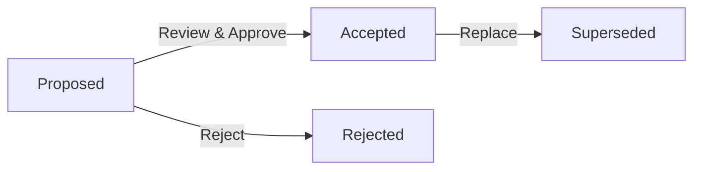

# Architecture Decision Records (ADRs)

This folder contains all Architecture Decision Records for the Laniakea-Edge project. ADRs document important architectural decisions along with their context and consequences.

## 📁 Current Structure

```
decisions/
├── 0000-use-markdown-architectural-decision-records.md
├── 0002-do-not-use-numbers-in-headings.md
├── template.md        # ADR template for new decisions
├── index.md          # ADR tooling setup instructions
└── README.md         # This index file
```

All ADRs are kept in this single directory with numbered prefixes for chronological ordering.

## 📚 Current ADRs

### Meta ADRs (About the ADR Process)
- [ADR-0000: Use Markdown Architectural Decision Records](0000-use-markdown-architectural-decision-records.md) - **Accepted**
- [ADR-0002: Do Not Use Numbers in Headings](0002-do-not-use-numbers-in-headings.md) - **Accepted**
- [ADR-0003: Use log4brains for ADR Management](0003-use-log4brains-for-adr-management.md) - **Accepted**

### Project ADRs
*No project-specific ADRs created yet. See pending decisions below.*

## 📊 ADR Status Overview

### Summary Statistics

| Status     | Count | Percentage |
| ---------- | ----- | ---------- |
| Proposed   | 0     | 0%         |
| Accepted   | 3     | 100%       |
| Superseded | 0     | 0%         |
| **Total**  | **3** | -          |

### Pending Decisions (Phase 1 Priority)

| Decision                | Priority    | Target Date | Status      |
| ----------------------- | ----------- | ----------- | ----------- |
| API Framework Selection | 🔴 Critical | Week 2      | Not Started |
| AI Framework Selection  | 🔴 Critical | Week 2      | Not Started |
| Python Version          | 🔴 Critical | Week 1      | Not Started |
| Service Architecture    | 🔴 Critical | Week 2      | Not Started |

## 📝 ADR Process

### Creating a New ADR

**Use meaningful filenames (e.g., 001-use-postgresql.md) and maintain a numbered or dated sequence for easy navigation.**

1. **Copy the template**:

   ```bash
   cp template.md 0003-your-decision-title.md
   ```
   
   Use the next sequential number (0003, 0004, etc.)

2. **Fill out all sections**:

   - Status (Proposed)
   - Context (problem background)
   - Decision (what we're doing)
   - Consequences (positive, negative, risks)
   - Alternatives (options considered)
   - Implementation (action items)

3. **Submit for review**:
   - Create pull request
   - Tag relevant stakeholders
   - Schedule review meeting if needed

### ADR Lifecycle



### Review Criteria

ADRs are evaluated based on:

- **Completeness**: All sections filled comprehensively
- **Clarity**: Decision and rationale are clear
- **Evidence**: Data/research supports the decision
- **Impact**: Consequences are well understood
- **Alternatives**: Other options were considered

## 📋 ADR Index

### Accepted

- **[ADR-0000](0000-use-markdown-architectural-decision-records.md)**: Use Markdown Architectural Decision Records
- **[ADR-0002](0002-do-not-use-numbers-in-headings.md)**: Do Not Use Numbers in Headings
- **[ADR-0003](0003-use-log4brains-for-adr-management.md)**: Use log4brains for ADR Management

### Proposed

_No ADRs currently proposed_

### Superseded

_No ADRs currently superseded_

## 🎯 Upcoming Decisions Queue

### Week 1 (Immediate)

- [ ] ADR-001: Python Version Selection (3.11 vs 3.12)

### Week 2 (Critical)

- [ ] ADR-002: API Framework Selection (FastAPI vs Flask vs Django)
- [ ] ADR-003: AI Framework Selection (LangChain vs LlamaIndex)
- [ ] ADR-004: Service Architecture Pattern (Microservices vs Monolith)

### Week 3-4 (Important)

- [ ] ADR-005: Testing Framework and Strategy
- [ ] ADR-006: Container and Orchestration Platform
- [ ] ADR-007: Database Technology Selection
- [ ] ADR-008: Caching Strategy

### Week 5-8 (Planning)

- [ ] ADR-009: CI/CD Platform Selection
- [ ] ADR-010: Monitoring and Observability Stack
- [ ] ADR-011: Security and Authentication Approach
- [ ] ADR-012: Deployment Platform and Strategy

## 📐 ADR Template Structure

Each ADR follows this structure:

```markdown
# ADR-YYYY-MM-DD: [Title]

## Status

Proposed | Accepted | Superseded | Deprecated

## Context

What is the issue we're seeing that is motivating this decision?

## Decision

What we're doing and how we're doing it.

## Consequences

### Positive

- What becomes easier or better?

### Negative

- What becomes harder or more complex?

### Risks

- What could go wrong?

## Alternatives Considered

### Alternative 1: [Name]

- Description
- Why we didn't choose it

## Implementation

Key steps to implement this decision

## References

- Links to relevant documentation
```

## 🔍 Finding ADRs

### By Category

- **Infrastructure**: Deployment, scaling, monitoring
- **Architecture**: Services, communication, patterns
- **Technology**: Languages, frameworks, libraries
- **Security**: Authentication, authorization, encryption
- **Development**: Testing, CI/CD, tooling

### By Impact

- **High Impact**: Affects entire system architecture
- **Medium Impact**: Affects specific services/components
- **Low Impact**: Local optimizations or tools

### By Date

ADRs are named with date prefix (YYYY-MM-DD) for chronological ordering.

## 📊 Decision Metrics

### Decision Velocity

- Target: 2-3 decisions per week during Phase 0
- Current: 0 decisions per week
- Status: 🔴 Behind schedule

### Decision Quality

Measured by:

- Time to implementation
- Reversal rate
- Team satisfaction
- Technical debt created

## 🔗 Related Documentation

### Context and Research

- [`../1-research/`](../1-research/) - Background research
- [`../2-planning/decisions-matrix.md`](../2-planning/decisions-matrix.md) - Decision tracking

### Implementation Guidance

- [`../3-architecture/`](../3-architecture/) - Architecture documentation
- [`../5-reference/tech-stack.md`](../5-reference/tech-stack.md) - Technology options

## 📅 Review Schedule

| Day       | Activity            |
| --------- | ------------------- |
| Monday    | New ADRs proposed   |
| Wednesday | Team review session |
| Friday    | Approval/feedback   |

## 🚦 ADR Health Indicators

### Good Signs ✅

- Clear problem statement
- Multiple alternatives evaluated
- Quantifiable success criteria
- Implementation plan included
- Team consensus achieved

### Warning Signs ⚠️

- Vague problem definition
- Single solution considered
- No success metrics
- Missing implementation steps
- Lack of team buy-in

## 📝 Maintenance

### Regular Tasks

- Weekly: Update ADR index
- Monthly: Review superseded ADRs
- Quarterly: ADR process retrospective

### Quality Checks

- [ ] All decisions have ADRs
- [ ] ADRs follow template
- [ ] Status is current
- [ ] Implementation tracked

---

_This directory will grow as architectural decisions are made and documented throughout the project lifecycle._
