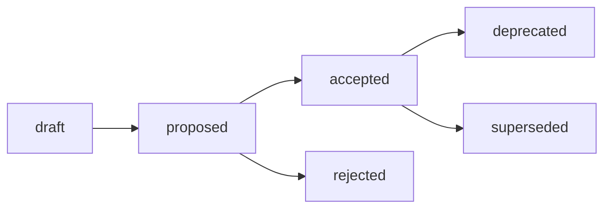

# ADR Workflow with log4brains

This guide explains how to create, manage, and publish Architecture Decision Records (ADRs) using log4brains in the Laniakea-Edge project.

## Table of Contents
- [Prerequisites](#prerequisites)
- [Installation](#installation)
- [Creating ADRs](#creating-adrs)
- [Managing ADRs](#managing-adrs)
- [Viewing ADRs](#viewing-adrs)
- [Publishing ADRs](#publishing-adrs)
- [Best Practices](#best-practices)

## Prerequisites

- Node.js v18+ installed (log4brains requires Node.js)
- npm or yarn package manager
- Git repository access
- Basic understanding of [ADRs](https://adr.github.io/)

## Installation

### Global Installation (Recommended)

```bash
npm install -g log4brains
```

### Project Installation (Already configured)

The project has log4brains configured. To set up your local environment:

```bash
# Install project dependencies
npm install

# Verify log4brains is available
npx log4brains --help
```

## Creating ADRs

### 1. Create a New ADR

```bash
# Basic command
log4brains adr new

# With a title
log4brains adr new "Choose Python 3.11 as runtime version"
```

This will:
1. Create a new ADR file with the next sequential number
2. Open your default editor with the ADR template
3. Add YAML frontmatter for log4brains metadata

### 2. ADR Template

When you create a new ADR, you'll see this template:

```markdown
---
status: draft
date: 2025-01-07
decision-makers: []
consulted: []
informed: []
---

# [ADR Title]

## Context and Problem Statement

[Describe the context and problem]

## Decision Drivers

- [Driver 1]
- [Driver 2]

## Considered Options

- [Option 1]
- [Option 2]
- [Option 3]

## Decision Outcome

Chosen option: "[option]", because [justification]

### Consequences

- Good, because [positive consequence]
- Bad, because [negative consequence]

## Pros and Cons of the Options

### [Option 1]

[Description]

- Good, because [argument]
- Bad, because [argument]
```

### 3. Fill Out the ADR

Follow these guidelines:

1. **Status**: Start with `draft`, change to `proposed` when ready for review, then `accepted` when approved
2. **Date**: Use YYYY-MM-DD format
3. **Decision-makers**: List people involved in the decision
4. **Context**: Clearly explain the problem being solved
5. **Options**: Document all serious alternatives considered
6. **Decision**: State the chosen option clearly
7. **Consequences**: Be honest about trade-offs

## Managing ADRs

### Status Workflow



### Update ADR Status

Edit the YAML frontmatter:

```yaml
---
status: accepted  # draft | proposed | accepted | rejected | deprecated | superseded
date: 2025-01-07
---
```

### Supersede an ADR

When creating a new ADR that replaces an old one:

1. Create the new ADR
2. Update the old ADR's status to `superseded`
3. Add a note in the old ADR pointing to the new one:

```markdown
---
status: superseded
superseded-by: 0042-new-decision.md
---

> ⚠️ This ADR has been superseded by [ADR-0042](0042-new-decision.md)
```

### Link Related ADRs

In the YAML frontmatter:

```yaml
---
links:
  - 0001-related-decision.md
  - 0002-another-related.md
---
```

## Viewing ADRs

### Local Development Server

```bash
# Start the log4brains development server
log4brains serve

# Open http://localhost:4004 in your browser
```

Features available in the web UI:
- Full-text search across all ADRs
- Filter by status
- Visualize relationships between ADRs
- Export as static site

### Command Line

```bash
# List all ADRs
log4brains adr list

# Search ADRs
log4brains adr list --search "python"

# View specific ADR
cat docs/decisions/0003-*.md
```

## Publishing ADRs

### Build Static Site

```bash
# Generate static HTML site
log4brains build

# Output is in .log4brains/out/
```

### GitHub Pages Deployment

The project is configured to automatically publish ADRs to GitHub Pages:

1. On push to `main` branch
2. GitHub Action builds the static site
3. Deploys to: `https://[org].github.io/laniakea-edge/adr/`

### Manual Deployment

```bash
# Build and preview locally
log4brains build
npx serve .log4brains/out

# Or use Python
cd .log4brains/out
python -m http.server 8000
```

## Best Practices

### 1. When to Create an ADR

Create an ADR when:
- Making significant architectural decisions
- Choosing between multiple technology options
- Changing existing architectural patterns
- The decision has long-term implications
- Team members disagree on approach

### 2. Writing Good ADRs

- **Be Concise**: ADRs should be 1-2 pages max
- **Be Honest**: Document real trade-offs
- **Be Specific**: Include version numbers, specific technologies
- **Be Timely**: Write ADRs when making decisions, not after
- **Be Collaborative**: Involve stakeholders in the process

### 3. ADR Reviews

Before marking an ADR as `accepted`:

1. **Technical Review**: Ensure technical accuracy
2. **Stakeholder Review**: Get input from affected parties
3. **Alternatives Check**: Verify all options were considered
4. **Consequences Check**: Ensure trade-offs are understood

### 4. Naming Conventions

- Files: `NNNN-short-descriptive-name.md`
- Titles: Clear, action-oriented (e.g., "Use log4brains for ADR Management")
- Status: Use standard statuses only

### 5. Categories and Tags

Use tags in frontmatter to categorize:

```yaml
---
tags:
  - infrastructure
  - security
  - api
  - database
---
```

## Common Commands Reference

```bash
# Create new ADR
log4brains adr new "Title"

# Start development server
log4brains serve

# Build static site
log4brains build

# List all ADRs
log4brains adr list

# Get help
log4brains --help
log4brains adr --help
```

## Troubleshooting

### Issue: Command not found

```bash
# Ensure log4brains is installed
npm list -g log4brains

# Or use npx
npx log4brains [command]
```

### Issue: Port already in use

```bash
# Use a different port
log4brains serve --port 4005
```

### Issue: Build fails

```bash
# Clear cache and rebuild
rm -rf .log4brains
log4brains init
log4brains build
```

## Additional Resources

- [log4brains Documentation](https://github.com/thomvaill/log4brains)
- [MADR Format](https://adr.github.io/madr/)
- [ADR GitHub Organization](https://adr.github.io/)
- [Michael Nygard's Original Article](http://thinkrelevance.com/blog/2011/11/15/documenting-architecture-decisions)

## Questions?

- Check existing ADRs: `docs/decisions/`
- Review log4brains docs: `log4brains --help`
- Create an issue for problems
- Discuss in team channels